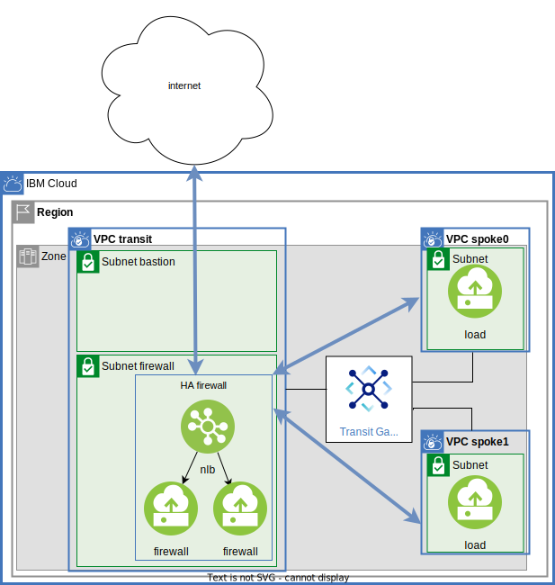
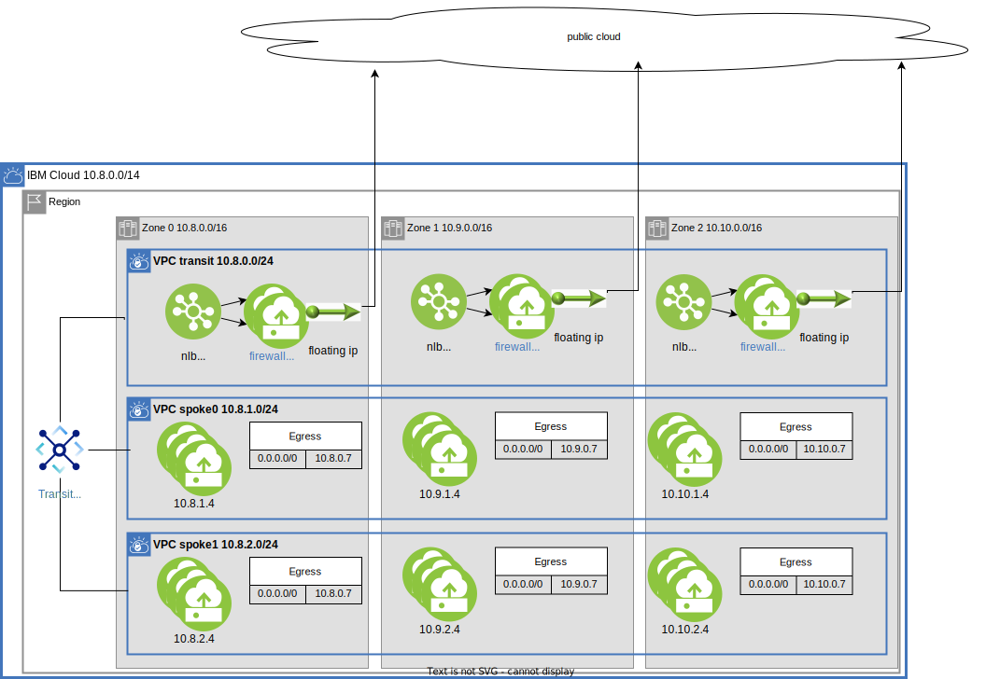
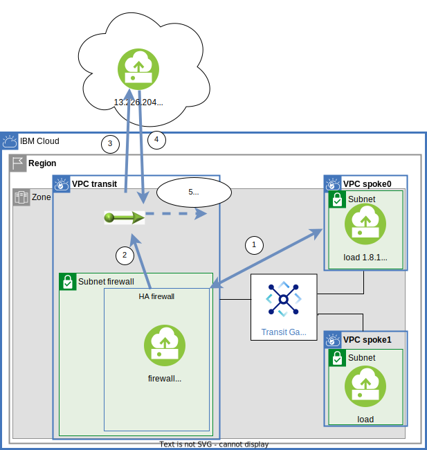
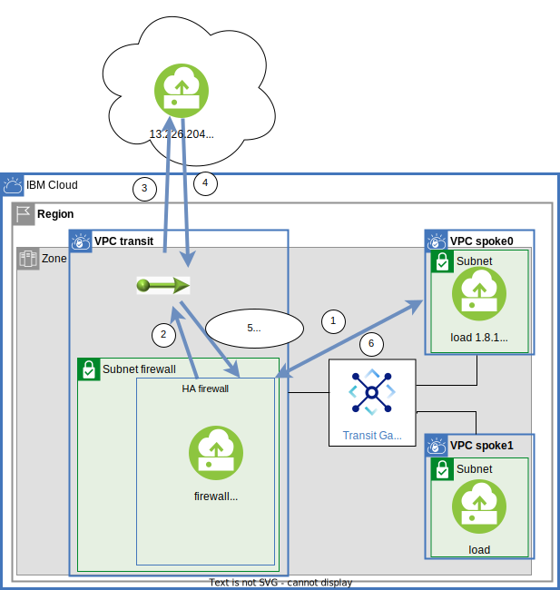

# Firewall appliances in a transit VPC
This is the companion repository for the blog post [VPC Transit Firewall](todo).  Terraform is used in this repository to depoloy the following architecture:

## Diagram showing flows:



- Bastion can be used to ssh to instances in the spokes
- Spoke instances can communicate with other spokes through the firewall
- Spoke instances can communicate with the internet through the firewall

## Diagram showning zones


The zonal struture of the architecture is important in design and results in simple routing rules:

- There are 3 zone CIDR blocks 10.8.0.0, 10.9.0.0 and 10.10.0.0
- Each VPC carves out a CIDR block in each zone
- Keeping traffic within a zone insures resiliancy from a zone failure

## Prerequisites

Before continuing you must satisfy the following prereequisites.
- Permissions to create resources including: VPC and instances, Transit Gateway, 
- [Shell with ibmcloud cli and terraform](https://cloud.ibm.com/docs/solution-tutorials?topic=solution-tutorials-tutorials)
- Follow the instructions to satisfy the [Prerequisites for NLB with routing mode](https://cloud.ibm.com/docs/vpc?topic=vpc-nlb-vnf&interface=ui)
- IAM policy to create instances with network interfaces that allow spoofing. [See about IP spoofing checks](https://cloud.ibm.com/docs/vpc?topic=vpc-ip-spoofing-about):
```
ibmcloud iam user-policy-create YOUR_USER_EMAIL_ADDRESS --roles "IP Spoofing Operator" --service-name is
```

## TLDR;

Create the vpcs, firewall, routes and transit bastion:
```
cp template.local.env local.env
# make any adjustments
vi local.env
source local.env
terraform init
terraform apply
```

Create the spoke instances to generate load:
```
cd load_tf
terraform init
terraform apply
```

By default one availability zone with one firewall is created which makes it easier to explore and test.

NOTE: The output generated in my example are shown below.  Your IP values will be different, adjust the steps accordingly.

Initial terraform apply output:

```
spokes = {
  "0" = {
    "vpc_id" = "r006-1897fe56-5b6f-487d-8e91-a381f16ca74d"
    "zones" = {
      "0" = {
        "routing_table_id" = "r006-70610d62-448a-4ed6-aee9-144b50f72952"
        "subnet_id" = "0717-c8664a11-d65a-4a62-8787-455e4ce53349"
        "zone" = "us-south-1"
      }
    }
  }
  "1" = {
    "vpc_id" = "r006-7f2903a3-045c-417e-9fc4-5ee45e3d6f69"
    "zones" = {
      "0" = {
        "routing_table_id" = "r006-81ffe1c9-6fd9-4929-8479-e79eae611546"
        "subnet_id" = "0717-7b0175a1-1312-4d8d-af8c-f2b12db4e25e"
        "zone" = "us-south-1"
      }
    }
  }
}
transit_zones = {
  "0" = {
    "bastion_floating_ip_address" = "52.118.184.49"
    "bastion_primary_ipv4_address" = "10.8.0.4"
    "firewalls" = {
      "0" = {
        "floating_ip_address" = "52.116.138.80"
        "primary_ipv4_address" = "10.8.0.196"
      }
    }
    "name" = "vpcfw-transit-1"
    "next_hop" = "10.8.0.198"
    "subnet_bastion_id" = "0717-0c87409e-a6b4-447d-93ed-acbff880ec9a"
    "vpc_id" = "r006-1aadb726-870e-4a8c-9cca-b30f7042ce58"
    "zone" = "us-south-1"
  }
}
```

load_tf output:

```
spoke_instances = [
  {
    "jump_floating_ip" = "52.118.184.49"
    "name" = "vpcfw-load-0-us-south-1"
    "primary_ipv4_address" = "10.8.1.4"
    "spoke_key" = "0"
    "ssh" = "ssh -J root@52.118.184.49 root@10.8.1.4"
    "zone" = "us-south-1"
    "zone_key" = "0"
  },
  {
    "jump_floating_ip" = "52.118.184.49"
    "name" = "vpcfw-load-1-us-south-1"
    "primary_ipv4_address" = "10.8.2.4"
    "spoke_key" = "1"
    "ssh" = "ssh -J root@52.118.184.49 root@10.8.2.4"
    "zone" = "us-south-1"
    "zone_key" = "0"
  },
]
```


It is interesting to inspect the routing table for one of the spokes.  Using the vpc_id and the routing_table_id.  Notice that all traffic (0.0.0.0/0) is routed to the Network Load Balancer, NLB.  The NLB forwards that to the firewall, with one exception for the bastion (discussed in [Spoke routing[(#spoke-routing) later):

```
$ ibmcloud is vpc-routing-table-routes r006-7f2903a3-045c-417e-9fc4-5ee45e3d6f69 r006-81ffe1c9-6fd9-4929-8479-e79eae611546
Listing routes for routing table r006-81ffe1c9-6fd9-4929-8479-e79eae611546 of vpc r006-7f2903a3-045c-417e-9fc4-5ee45e3d6f69 under account Powell Quiring's Account as user pquiring@us.ibm.com...
ID                                          Name                                       Action     Status   Destination   Next hop     Zone
r006-bc7d6518-3d92-47a0-872f-761a74c4bd18   vpcfw-spoke-1-us-south-1-transit-bastion   delegate   stable   10.8.0.4/32   0.0.0.0      us-south-1
```


Be ready to set up a couple of ssh sessions.  In one terminal ssh to the firewall.  Check out the iptables that confiure the firewall:
```
$ ssh root@52.116.138.80
....
root@vpcfw-transit-1-firewall-0:~# iptables-save
# Generated by iptables-save v1.8.4 on Tue Jun 21 15:26:48 2022
*nat
:PREROUTING ACCEPT [711:39575]
:INPUT ACCEPT [641:34107]
:OUTPUT ACCEPT [14:1814]
:POSTROUTING ACCEPT [71:6502]
-A POSTROUTING -s 10.8.0.0/16 -d 10.8.0.0/16 -p tcp -j ACCEPT
-A POSTROUTING -s 10.8.0.0/16 -p tcp -j SNAT --to-source 10.8.0.196
COMMIT
# Completed on Tue Jun 21 15:26:48 2022
# Generated by iptables-save v1.8.4 on Tue Jun 21 15:26:48 2022
*filter
:INPUT ACCEPT [2699:283426]
:FORWARD ACCEPT [16040:265456293]
:OUTPUT ACCEPT [2330:407614]
COMMIT
# Completed on Tue Jun 21 15:26:48 2022
```

The `*filter` section has a `:FORWARD ACCEPT` to allow all packets that are recieved and not addressed to this instance to be forwarded to the destination.  The traffic from the spokes will be forwarded towards the destination.  Each packet has a source address of the sender since a NLB is configured with [Direct Server Return](https://cloud.ibm.com/docs/vpc?topic=vpc-network-load-balancers).

The `*nat` section will be covered in more detail later and can be ignored for now.

On the firewall capture all of the packets to/from the spoke 1 instance (spoke_key == 1):

```
root@vpcfw-transit-1-firewall-0:~# tcpdump -n host 10.8.2.4
tcpdump: verbose output suppressed, use -v or -vv for full protocol decode
listening on ens3, link-type EN10MB (Ethernet), capture size 262144 bytes
```

In a different terminal ssh to the spoke 0 intance (spoke_key == 0), There is a handy ssh command that uses the transit bastion as a jump server.  Then curl to the spoke 1 instance:
```
$ ssh -J root@52.118.184.49 root@10.8.1.4
...
root@vpcfw-load-0-us-south-1-private:~# curl 10.8.2.4/instance
vpcfw-load-1-us-south-1-private
```

You should have noticed a burst of traffic on the firewalls tcpdump.  There is a pair for each packet, the first is when the firewall received the packet and the second is when the firewall FORWARDed the packet as described by iptables-save.  Forwarding is also effecting the return trip.  Here are the first four packets:
```
root@vpcfw-transit-1-firewall-0:~# tcpdump -n host 10.8.2.4
tcpdump: verbose output suppressed, use -v or -vv for full protocol decode
listening on ens3, link-type EN10MB (Ethernet), capture size 262144 bytes
15:36:01.025173 IP 10.8.1.4.38874 > 10.8.2.4.80: Flags [S], seq 1034822911, win 64240, options [mss 1460,sackOK,TS val 359570064 ecr 0,nop,wscale 7], length 0
15:36:01.025243 IP 10.8.1.4.38874 > 10.8.2.4.80: Flags [S], seq 1034822911, win 64240, options [mss 1460,sackOK,TS val 359570064 ecr 0,nop,wscale 7], length 0
15:36:01.026175 IP 10.8.2.4.80 > 10.8.1.4.38874: Flags [S.], seq 4014523402, ack 1034822912, win 65160, options [mss 1460,sackOK,TS val 1959068290 ecr 359570064,nop,wscale 7], length 0
15:36:01.026186 IP 10.8.2.4.80 > 10.8.1.4.38874: Flags [S.], seq 4014523402, ack 1034822912, win 65160, options [mss 1460,sackOK,TS val 1959068290 ecr 359570064,nop,wscale 7], length 0
```
## Configuration
There are a few terraform [variables](./variables.tf) that can be used to tune things up.  Here are a couple to look at:

- number_of_firewalls_per_zone - default 1, if your firewall supports multiple instances then scaling them could help with performance and availability.
- firewall_lb - default true, if you only have a single firewall there is no reason to use a NLB, lets set this to false and try again:

```
vi local.env; # uncomment export TF_VAR_firewall_lb=false
source local.env
terraform apply
```

The NLB will be deleted and the spoke routing tables will be configured to forward directly to the firewall.  Terraform output states the next_hop is the ip address of the firewall, 10.8.0.196 below:
```
transit_zones = {
  "0" = {
    "bastion_floating_ip_address" = "52.118.184.49"
    "bastion_primary_ipv4_address" = "10.8.0.4"
    "firewalls" = {
      "0" = {
        "floating_ip_address" = "52.116.138.80"
        "primary_ipv4_address" = "10.8.0.196"
      }
    }
    "name" = "vpcfw-transit-1"
    "next_hop" = "10.8.0.196"
    "subnet_bastion_id" = "0717-0c87409e-a6b4-447d-93ed-acbff880ec9a"
    "vpc_id" = "r006-1aadb726-870e-4a8c-9cca-b30f7042ce58"
    "zone" = "us-south-1"
  }
}
```

Confirm this in the spoke route tables has changed as well:
```
$ is vpc-routing-table-routes r006-7f2903a3-045c-417e-9fc4-5ee45e3d6f69 r006-81ffe1c9-6fd9-4929-8479-e79eae611546
Listing routes for routing table r006-81ffe1c9-6fd9-4929-8479-e79eae611546 of vpc r006-7f2903a3-045c-417e-9fc4-5ee45e3d6f69 under account Powell Quiring's Account as user pquiring@us.ibm.com...
ID                                          Name                                       Action     Status   Destination   Next hop     Zone
r006-bc7d6518-3d92-47a0-872f-761a74c4bd18   vpcfw-spoke-1-us-south-1-transit-bastion   delegate   stable   10.8.0.4/32   0.0.0.0      us-south-1
r006-80a77bff-33d3-4567-b212-fb86b6551c38   vpcfw-spoke-1-us-south-1                   deliver    stable   0.0.0.0/0     10.8.0.196   us-south-1
```

To generate the zone level diagram above, verify the following variables are in the environment:

```
vi local.env;
source local.env
env | grep TF_VAR
TF_VAR_firewall_lb=true
TF_VAR_number_of_firewalls_per_zone=2
TF_VAR_number_of_zones=3
```

Apply:
```
terraform apply
```

## iptables firewall
If you have more then one firewalls_per_zone (export TF_VAR_number_of_firewalls_per_zone=2) the instructions below is only changing one of them.  You may want to apply the change before continuing:

```
vi local.env; # export TF_VAR_number_of_firewalls_per_zone=1
source local.env
terraform apply
```
### user_data
Check out the firewall instance configuration user_data

```
sysctl -w net.ipv4.ip_forward=1
echo 'net.ipv4.ip_forward=1' >> /etc/sysctl.conf 
```

### introduction
There are two example iptable firewall rules provided.  Return to the ssh session on a firewall.

public:
```
root@vpcfw-transit-1-firewall-0:~# cat /etc/iptables.public
*filter
:INPUT ACCEPT
:OUTPUT ACCEPT
:FORWARD ACCEPT
COMMIT
*nat
:PREROUTING ACCEPT
:INPUT ACCEPT
:OUTPUT ACCEPT
:POSTROUTING ACCEPT
-A POSTROUTING -s 10.8.0.0/16 -d 10.8.0.0/16 -p tcp -j ACCEPT
-A POSTROUTING -s 10.8.0.0/16 -p tcp -j SNAT --to-source 10.8.0.4
COMMIT
```

private:
```
root@vpcfw-transit-1-firewall-0:~# cat /etc/iptables.private
*filter
:INPUT ACCEPT
:OUTPUT ACCEPT
:FORWARD DROP
-A FORWARD -s 10.8.0.0/16 -d 10.8.0.0/16 -p tcp -j ACCEPT
COMMIT
*nat
COMMIT
```

The public is installed by default.  Here is a copy of a session to install the private:
```
root@vpcfw-transit-1-firewall-0:~# iptables-restore  /etc/iptables.private
root@vpcfw-transit-1-firewall-0:~# iptables-save
# Generated by iptables-save v1.8.4 on Wed Jun 22 17:01:38 2022
*nat
:PREROUTING ACCEPT [0:0]
:INPUT ACCEPT [0:0]
:OUTPUT ACCEPT [0:0]
:POSTROUTING ACCEPT [0:0]
COMMIT
# Completed on Wed Jun 22 17:01:38 2022
# Generated by iptables-save v1.8.4 on Wed Jun 22 17:01:38 2022
*filter
:INPUT ACCEPT [9:648]
:FORWARD DROP [0:0]
:OUTPUT ACCEPT [10:1144]
-A FORWARD -s 10.8.0.0/16 -d 10.8.0.0/16 -p tcp -j ACCEPT
COMMIT
# Completed on Wed Jun 22 17:01:38 2022
```

Notice that the FORWARD chain is set to DROP all packets except the ones where -s (source) and -d (destination) are in the availability zone.  Packets to/from the internet are dropped.  The `*nat` table is ACCEPT all and no longer contributing to POSTROUTING table - just a nop.

### iptables snat table
The public iptable rules has the section:

```
*nat
:PREROUTING ACCEPT
:INPUT ACCEPT
:OUTPUT ACCEPT
:POSTROUTING ACCEPT
-A POSTROUTING -s 10.8.0.0/16 -d 10.8.0.0/16 -p tcp -j ACCEPT
-A POSTROUTING -s 10.8.0.0/16 -p tcp -j SNAT --to-source 10.8.0.4
```
In the POSTROUTING chain you can see that packets with source/desgination in the availability zone are simply ACCEPTed.  But the rest of the packets, those destine for the internet, are sent to the SNAT table.

Without SNAT:



With SNAT:




It is a little subtle.  On the failure 

Here is a tcpdump of this in action when a spoke is attempting to access an internet destination: 13.226.204.104


```
root@vpcfw-transit-1-firewall-0:~# tcpdump -n host 13.226.204.104
tcpdump: verbose output suppressed, use -v or -vv for full protocol decode
listening on ens3, link-type EN10MB (Ethernet), capture size 262144 bytes
17:29:28.117073 IP 10.8.1.4.51762 > 13.226.204.104.80: Flags [S], seq 1988460719, win 64240, options [mss 1460,sackOK,TS val 1316100569 ecr 0,nop,wscale 7], length 0
17:29:28.117118 IP 10.8.0.4.51762 > 13.226.204.104.80: Flags [S], seq 1988460719, win 64240, options [mss 1460,sackOK,TS val 1316100569 ecr 0,nop,wscale 7], length 0
17:29:28.118795 IP 13.226.204.104.80 > 10.8.0.4.51762: Flags [S.], seq 57195242, ack 1988460720, win 65535, options [mss 1440,sackOK,TS val 3279229737 ecr 1316100569,nop,wscale 9], length 0
17:29:28.118815 IP 13.226.204.104.80 > 10.8.1.4.51762: Flags [S.], seq 57195242, ack 1988460720, win 65535, options [mss 1440,sackOK,TS val 3279229737 ecr 1316100569,nop,wscale 9], length 0
17:29:28.119776 IP 10.8.1.4.51762 > 13.226.204.104.80: Flags [.], ack 1, win 502, options [nop,nop,TS val 1316100572 ecr 3279229737], length 0
17:29:28.119776 IP 10.8.1.4.51762 > 13.226.204.104.80: Flags [P.], seq 1:79, ack 1, win 502, options [nop,nop,TS val 1316100572 ecr 3279229737], length 78: HTTP: GET / HTTP/1.1
...
```

Looking line by line:

- 17:29:28.117073 IP 10.8.1.4.51762 > 13.226.204.104.80: firewall received the packet from the spoke
- 17:29:28.117118 IP 10.8.0.4.51762 > 13.226.204.104.80: firewall sent the packet to the internet.  Notice it is from the firewall (this is the SNAT)
- 17:29:28.118795 IP 13.226.204.104.80 > 10.8.0.4.51762: firewall received packet from the internet, destination is the firewall
- 17:29:28.118815 IP 13.226.204.104.80 > 10.8.1.4.51762: firewall forwarded the packet back to the spoke

